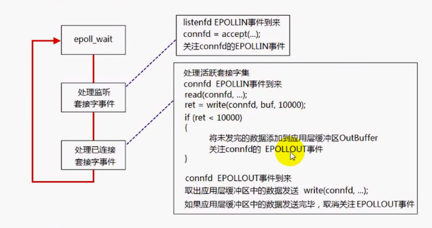
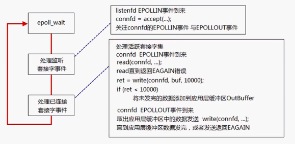

### echosrv_epoll.cpp

#### poll

每次调用poll函数，都需要把监听套接字与已连接套接字所关注的数组拷贝到内核

#### epoll LT
电平触发，高电平为事件发生

最开始不能关注EPOLLOUT事件，因为发送缓冲区存在剩余空间，会不断触发EPOLLOUT，形成busy-loop

数据都发送完毕，取消关注pollout事件，否则也会形成busy-loop

#### epoll ET

边沿触发，电平变化为事件发生

最开始关注EPOLLIN和EPOLLOUT事件，不会出现busy-loop

read读取完接收缓冲区的所有数据，会返回EAGAIN错误，否则的话，一直处于高电平状态，即使有数据到达也不会触发

应用缓冲区数据未全部拷贝出来的，发送EAGAIN的原因：EPOLLOUT事件到达时，发送缓冲区处于高电平状态，写缓冲区直到EAGAIN，使发送缓冲区变为低电平状态，否则发送缓冲区始终处于高电平状态，无法再触发EPOLLOUT事件

###### EMFILE使用ET存在的问题

监听描述符的EPOLLIN最开始处于低电平状态，有连接后变为高电平状态，但是EMFILE情况下，accept返回失败，EPOLLIN始终处于高电平状态，后续无法触发监听套接字的EPOLLIN

#### select/poll/epoll比较

##### select

* 原理
    * select本质上是通过设置或检查存放fd标志位的数据结构来进行下一步处理，缺点

    * 单个进程可监视的fd数量被限制（1024个）
    * 需要维护一个用来存放大量fd的数据结构，这样会使得用户空间和内核空间在传递该结构时开销大
    * 对socket进行扫描时是线性扫描
* 最大连接数 FD_SETSIZE，32个整数大小，32位机器为32*32个 
* fd增加，性能下降（线性遍历）
* 消息传递方式 消息需要在用户空间和内核空间之间拷贝

##### poll

* 原理
    * poll在本质上和select没有区别，将用户传入的数组拷贝到内核空间，然后查询每个fd对应的设备状态，如果设备就绪，就在设备等待队列中加入一项并继续遍历，遍历完所有fd之后如果没有发现就绪设备，则挂起当前进程，知道设备就绪或主动超时，进程被唤醒后会再次遍历fd
    * 没有最大连接数限制，因为内核中是基于链表存储的
    * 缺点：用户空间和内核空间复制fd数组；水平触发，即报告fd之后，如果没有被处理，下次poll会再次报告
        * mmap：内存映射文件，将一个文件或其他对象映射到进程的地址空间，实现文件磁盘地址和进程虚拟地址空间中一段虚拟地址的一一对应关系，进程可以采用指针的方式读写这一段内存，系统会自动会写脏页面到对应的文件磁盘上；内核空间对这段区域的修改，也直接反映到用户空间，从而可以显现不同进程间的文件共享 
* 最大连接数 没有上限
* fd增加，性能下降（线性遍历）
* 消息传递方式 消息需要在用户空间和内核空间之间拷贝

##### epoll

* 原理
    * 使用mmap减少复制开销
    * 使用“事件”的就绪通知方式，通过epoll_clt注册fd，一旦fd就绪，内核会采用类似callback的回调机制来激活该fd，epoll_wait可以接收到通知
* 有上限但很大
* 只有活跃的socket会主动调用callback，在少量socket活跃的情况下，没有fd增加性能下降题，所有sock都活跃的情况下，可能会有性能下降
* 共享内存传递消息不需要拷贝
    * 已连接套接字不大且不停活跃时，epoll可能比poll和select效率低，因为需要调用callback，内部实现更复杂
    * 处理大量文件时，epoll效率更高