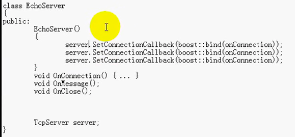

### muduo介绍

基于对象编程

library/framework
* library中的类相对独立，我们编写应用的时候需要编写一些胶水代码来粘合
* 框架能够应用于特定领域，使得框架能够调用我们所编写的回调函数，使得**控制翻转**

#### 面向对象 

基类指针调用派生类成员函数：虚函数的多态

如果基类为库，虚函数多态相当于调用了应用层编写的接口，即虚函数具有回调功能

面向对象编程风格会暴露抽象类

面向对象的方法实现server
* 基类 TcpServer 派生类 EchoServer
* 派生类复写基类的onConnection、onMessage、onClose
**虚函数可以实现回调功能**

#### 基于对象 

基于对象编程风格不会暴露抽象类，只是用具体类

基于对象的方法实现server

c++ 可以使用boost bind/function（类似于函数适配器）

c 注册全局函数到网络库，网络库通过函数指针来回调

面向对象风格，用一个EchoServer（派生类）继承一个Tcpserver（抽象类），实现三个接口onConnection、onMessage、onClose

基于对象风格，用一个EchoServer包含一个TcpServer（具体类），在构造函数中用boost::bind来注册三个成员函数

面向对象的效率更高些