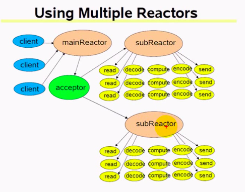

### 循环/迭代式服务器

以上方式称为短连接，处理完请求之后关闭连接，请求的执行时间不能过长，否则会影响其他客户端的连接

长连接在write之后可以返回read，即不关闭连接

为单线程的应用程序

### 并发式服务器

一个连接一个进程或一个连接一个线程

适合执行时间较长的服务

以上方式为长连接

如果每个连接一个线程的话，在主进程中不需要进行关闭监听套接字了，因为线程不会复制套接字，在线程中会对套接字进行关闭

如果是每个连接一个进程，在主进程中需要关闭监听套接字，因为子进程会复制父进程的套接字，套接字被打开两次，因此需要在父进程和子进程中都对套接字进行关闭

### 预先创建进程或线程

惊群现象：当客户端连接到达时，多个子进程的accept返回

和并发式服务器相比的优点：预先创建进程/线程，减少了进程创建的开销，提高了响应速度

### ** 反应式服务器

**为muduo支持的方式

reactive / reactor

并发处理多个请求，实际上是在一个线程中完成的，无法利用多核CPU

不适合执行时间较长的服务

### reactor + thread per request

每个请求创建一个线程

### reactor + worker thread

每个连接在一个工作的线程中完成

### ** reactor + thread pool

能适应密集计算

### multiple reactors

#### ** reactors in threads

#### reactors in processes

能适应更大的突发I/O

每个线程或每个进程都有一个event loop

### multiple reactors

轮叫 round robin

一个reactor适应一个千兆网口

subReactor可以看做是线程池，线程的数目是一开始固定的

### ** multiple reactors + threadpool

one loop per thread（必须是线程，因为进程无法共享线程池） + threadpool

突发I/O与密集计算

reactor（I/O线程）的线程池、Threadpool（计算线程的线程池）

多个reactor共享一个threadpool

### proactor

基于异步I/O，理论上proactor比reactor效率更高些

### 线程分类

* I/O线程（这里特指网络线程）

* 计算线程

* 第三方库所用线程，如loggong，database