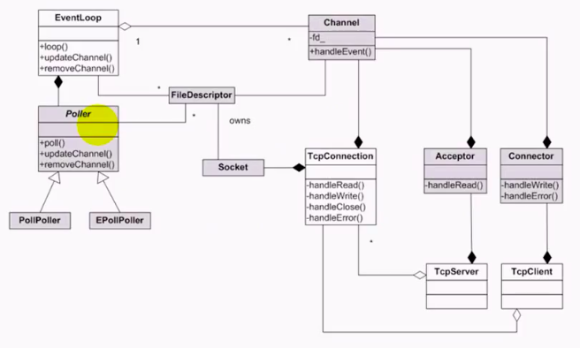
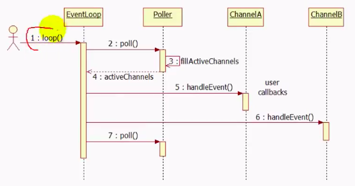

### muduo网络库类图

* eventloop是对事件循环的抽象

**eventloop中包含一个特殊的channel对象，用来唤醒循环，eventloop会控制该channel的生存期**

* poller是对I/O复用的抽象

以上两个的关系组合，一个eventloop包含一个poller，并且poller的生存期由eventloop来控制，eventloop的loop函数实际上调用poller的poll函数实现

* channel是对I/O事件的注册与响应的封装 

调用channel的update函数时，实际上调用了eventloop函数的updateChannel，进而调用poller的updateChannel，将channel注册到poller当中，或者将文件描述符的一些可读可写事件注册到poller当中

一个eventloop包含多个channel，可以用来捕捉多个通道的可读可写事件，为聚合关系，eventloop不负责channel生存期的控制

**channel不拥有文件描述符**， channel对象销毁的时候不关闭文件描述符，channel和文件描述符是关联关系，一个channel有一个fd；文件描述符被套接字所拥有，其生存期由套接字控制，即套接字销毁时关闭文件描述符

channel是TcpConnection、Acceptor、Connector的成员，关系为组合，**channel的生存期由TcpConnection、Acceptor、Connector来控制**

* Acceptor是对被动套接字的抽象

acceptor关注的是监听套接字的可读对象，由channel来注册，可读事件发生后，channnel调用handlEvent，然后回调handleRead，是基于对象的编程思想

acceptor是TcpServer的成员，生存期由TcpServer来控制

* Connector是对主动连接的抽象

* TcpConnection是对已连接套接字的抽象

一旦被动连接和主动连接建立之后，就会得到一个已连接套接字

TcpServer和TcpConnection是聚合的关系，一个TcpServer包含多个TcpConnection，但是不控制Tcpconnection的生存期

### muduo网络库时序图

