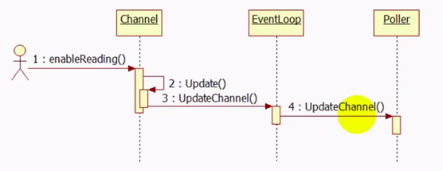

### 定时器函数选择

timefd_create把时间变成一个文件描述符，该文件在定时器超时的那一刻变得可读，这样就能很方便地融入到select/poll框架中，用统一的方式处理IO事件和超时事件

signalfd：创建一个文件描述符来接收信号

```c
int timerfd_create(int clockid, int flags);
```

用来创建一个定时器描述符timerfd

第一个参数clockid指定时间类型，有两个值

* CLOCK_REALTIME:Systemwide realtime clock 系统范围内的实时时钟

* CLOCK_MONOTONIC:以固定的速率运行，从不进行调整和复位，它不受任何系统time-of-day时钟修改的影响

第二个参数：flags可以是0或者O_CLOEXEC/O_NONBLOCK。

返回值：timerfd（文件描述符）

```c
struct timespec {
    time_t tv_sec;                /* Seconds */
    long   tv_nsec;               /* Nanoseconds */
};

struct itimerspec {
    struct timespec it_interval;  /* Interval for periodic timer */
    struct timespec it_value;     /* Initial expiration */
};
```

第二个结构体itimerspec就是timerfd要设置的超时结构体，其成员it_value表示定时器的第一次超时时间，it_interval表示之后的超时时间即间隔多长时间超时

```c
int timerfd_settime(int fd, int flags, const struct itimerspec *new_value, struct itimerspec *old_value);
```

该函数用来启动或关闭fd指定的定时器

fd：timerfd，有timerfd_create函数返回

new_value：指定新的超时时间，设定为new_value.it_value，非零则启动定时器，否则关闭定时器，如果new_value.it_interval为0，则定时器只定时一次，即初始那次，否则之后每个it_interval超时一次

old_value：不为null，则返回定时器这次设置之前的超时时间

flags：1代表设置的是绝对时间；0代表的是相对时间

```c
int timerfd_gettime(int fd, struct itimerspec *curr_value);
```

该函数用来获得定时器距离下次超时还剩下的时间，如果调用时定时器已经到期，并且该定时器处于循环模式（设置超时时间时，it_interval不为0），那么调用此函数之后定时器重新开始计时 

### enableReading



