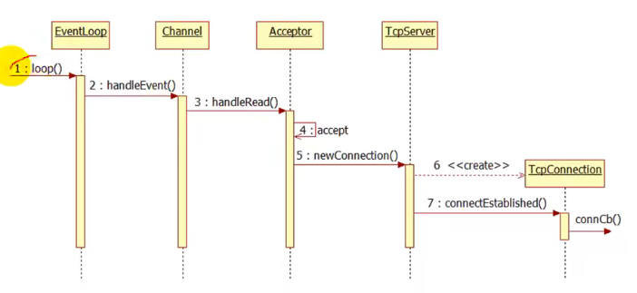

### TcpServer/TcpConnection

Acceptor类的功能主要是socket、bind、listen

一般来说，在上层应用程序中，我们不直接使用Acceptor，而是把它作为TcpServer的成员

TcpServer还包含了一个TcpConnection列表

TcpConnection与Acceptor类似，有两个重要的数据成员，Socket与Channel

* 当一个连接到来，eventloop的loop循环返回了一个活跃通道channel，该通道实际上是acceptor中的一个通道

* 当通道返回，调用channel的handleEvent来处理事件

* 进而回调acceptor的handleRead来处理可读事件

* handleRead中调用accept，产生一个新的连接

* 回调TcpServer的newConnection函数，创建一个新的Tcp连接TcpConnection，通过该对象调用connectEstablished函数，然后回调用户注册的函数connCb