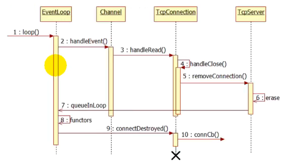

### TcpConnection生存期管理

* 连接断开为可读事件，前面处理流程和可读事件相同loop() → handleEvent() → handleRead() → read返回为0

* read返回值为0，调用handleClose()，回调TcpServer的removeConnection()，TcpServer将TcpConnection移除

**erase处不能立即销毁TcpConnection对象，TcpConnection被销毁，其包含的Channel对象也会被销毁，此时正在调用Channel的handleEvent函数，Channel如果被销毁，会产生core dump；因此，TcpConnection的生存期应该长于handleEvent()，可以使用shared_ptr来管理TcpConnection对象**

* 当连接到来时，创建一个TcpConnection对象，立刻使用shared_ptr来管理，引用计数为1

* 在Channel中维护一个weak_ptr(tie_)，将shared_ptr对象赋值给tie_，引用计数仍为1

* 当连接关闭，在handleEvent中将弱指针提升，得到一个shared_ptr对象，引用计数就变为了2；因此，在TcpServer中对TcpConnection进行erase不会销毁TcpConnection对象

* erase之后会回调queueInLoop，将connectDestroyed()函数放置eventloop的functors中，TcpConnection引用计数+1

* handleEvent函数返回之后，其提升的TcpConnection的引用计数-1

* connectDestroyed()调用用户的回调函数，TcpConnection彻底被销毁，connectDestroyed()是boost::function函数，其中持有的TcpConnection引用计数为1，当boost::function被销毁时，TcpConnection引用计数变为0

### boost::enable_shared_from_this

