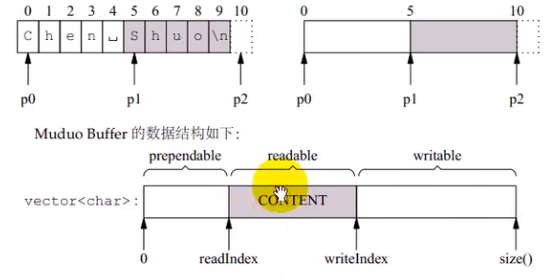
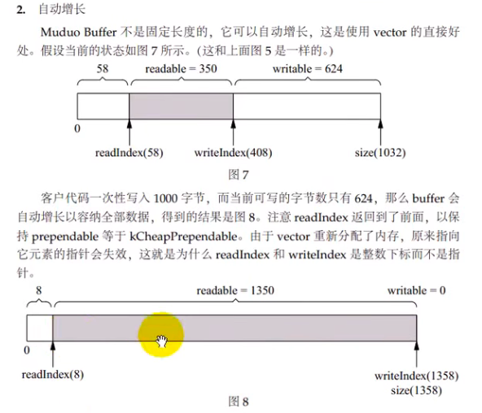
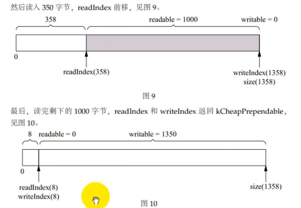
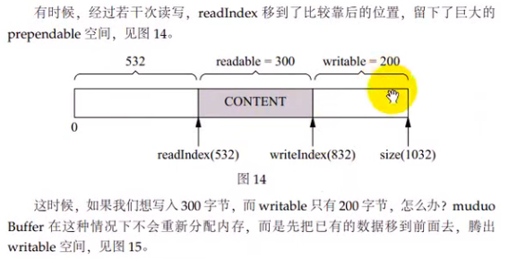
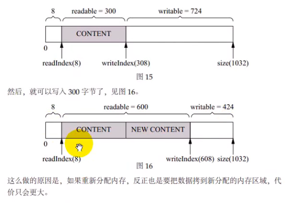
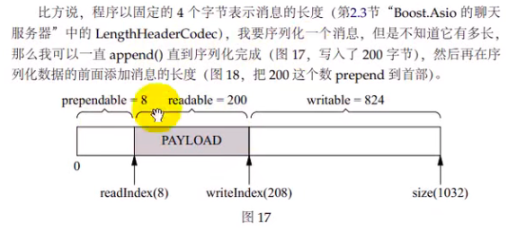
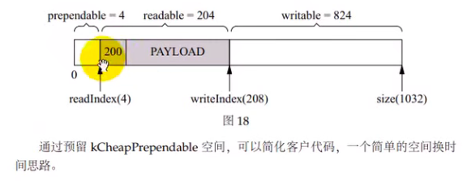

### 应用层的buffer设计

muduoI/O模型使用非阻塞模式，原因：使用阻塞模型，则I/O线程可能阻塞在read或write的系统调用之上，即使其他连接有事件到来，I/O线程也无法对其进行处理

应用层缓冲区的必要性：

* 发送缓冲区：应用程序只负责生成数据，并不关心数据是一次性发送还是分几次发送，这些应该由网络库来操心，操作系统无法一次性接收所有数据的情况下，剩余数据应该由网络库接管，将其保存在缓冲区中，然后注册pollout事件，一旦socket可写就立刻发送数据；剩余数据写完就取消关注pollout事件，以免造成busy loop；buffer中还有未发送数据，程序关闭连接，此时网络库等待数据发送完毕后关闭连接

* 接收缓冲区：TCP是一个无边界的字节流协议，接收方必须要处理”收到的数据尚不构成一条完整的消息“和”一次收到两条消息的数据“等情况（粘包）；接收到数据，存到应用层的接收缓冲区中，通知上层的应用程序，回调OnMessage(Buffer* buff)，根据应用层协议判定是否是一个完整的包，如果不是一条完整的消息，则不会取走数据，也不会进行相应的处理，如果是一条完成的消息，会将消息从缓冲区中读出并处理

### Buffer设计要求

* 对外表现为一块连续的内存，以方便用户代码编写

* size也已自动增长，以适应不同大小的消息

* 内部以vector of char来保存数据，并提供相应的访问函数

### Buffer数据结构

* 自动增长：增长到需要长度，会出现内存腾挪

buffer不会缩小，下次写数据不会重新分配内存，写入更大的数据也不一定重新分配内存，因为vector的size和capacity的大小不一定相等

* 内存腾挪

* prepend：长度可能不是固定8bytes，让程序以很低的代价在数据前面添加几个字节；prepend最少保留8bytes

### epoll使用LT模式的原因

* 与poll兼容

* LT模式不会发生漏掉事件的bug，但是pollout事件不能一开始就关注，否则会出现busyloop，而应该在write无法完全写入内核缓冲区的时候才关注，将未写入内核缓冲区的数据添加到应用层的输出缓冲区中，直到应用层的输出缓冲区数据全部写完，停止关注pollout事件

* 读写的时候不必等待eagain，可以节省系统调用的次数，降低延迟 
