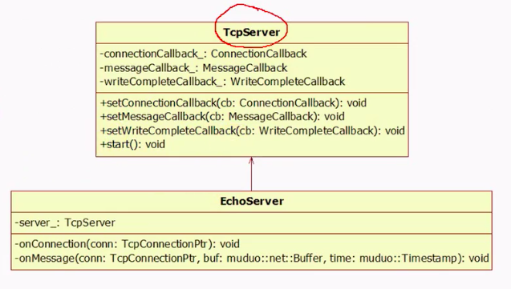

### TCP数据包处理流程

* 网络库事件循环中的可读事件触发

* 将数据从内核缓冲区移动到应用缓冲区中，同时网络库会回调OnMessage

* 用户空间OnMessage根据协议判断数据报是否是一个完整的数据包，如果不是，OnMessage立刻返回，直到内核又接收了一部分数据，网络库事件循环的可读事件再次触发，数据从内核接收缓冲区拷贝到应用接收缓冲区中

* OnMessage判断数据是一个完整的数据包，read → decode → compute → encode → write；继续判断剩余内容是否是一个完整的数据包（循环）

* write(buf, ...) 将buf数据填入内核缓冲区，内核缓冲区空间足够，数据全部填入，触发一个发送完成事件，网络库回调一个OnWriteComplete；如果缓冲区空间不够，剩余数据添加到应用层的发送缓冲区当中

* 当内核发送缓冲区有可用空间，会触发套接字的可写事件，应用缓冲区的数据拷贝到内核缓冲区

### TCP服务器实现

TCPServer注册三个回调函数：ConnectionCallback、MessageCallback、WriteCompleteCallback，将上层的回调函数注册进来

EchoServer：基于对象的编程思想，包含一个TCPServer

one loop per thread：每个线程最多只能有一个eventloop对象

eventloop对象构造的时候，会检查当前线程是否创建了其他eventloop对象，如果已经创建，终止程序

eventloop构造函数会记住本对象所属线程

创建了eventloop对象的线程称为IO线程，其功能是运行事件循环